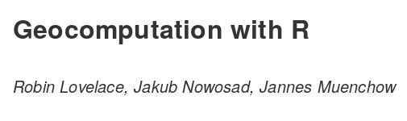

```{r setup, include=FALSE}
options(htmltools.dir.version = FALSE)
```

### Spatial R

---
### Geocomputation

---
### The **sf** package

<!-- read shapefile + plot -->

---
### ...

<!-- input pairs of coordinates (non-wgs 84 coords) -->

---
### Geocoding 

<!-- wgs84 -->

---
### ...

<!-- miss matches (coords) -->

---
### Data join

<!-- left join beer sales? -->

---
### Plots

---
### Conclusions

---
class: middle



The online version of the book is at http://geocompr.robinlovelace.net/ and its source code at https://github.com/robinlovelace/geocompr.

We encourage contributions on any part of the book, including:

- Improvements to the text, e.g. clarifying unclear sentences, fixing typos (see guidance from [Yihui Xie](https://yihui.name/en/2013/06/fix-typo-in-documentation/))
- Changes to the code, e.g. to do things in a more efficient way
- Suggestions on content (see the projects [issue tracker](https://github.com/Robinlovelace/geocompr/issues) and the [work-in-progress](https://github.com/Robinlovelace/geocompr/tree/master/work-in-progress) folder for chapters in the pipeline)

Please see [our_style.md](https://github.com/Robinlovelace/geocompr/blob/master/our_style.md) for the books style.

---
class: middle

# Thanks!

`r icon::ii_social_twitter()` jakub_nowosad

`r icon::ii_ios_book()` https://geocompr.robinlovelace.net/